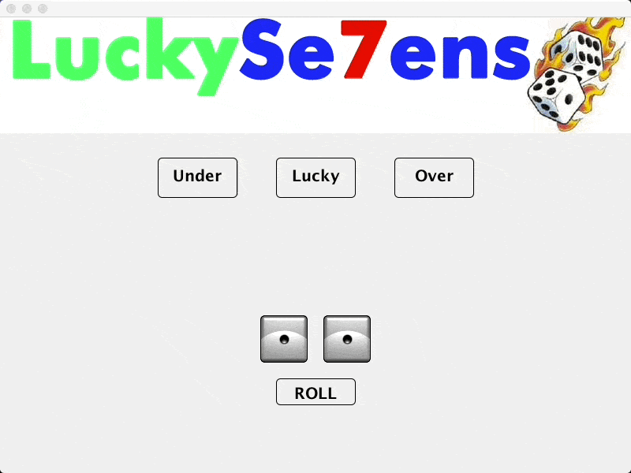

# Under Over 7 dice game.
## Features simple dice animations. The object of the game is to predict whether the dice will roll to a total of under 7 or over 7 or at 7.

* Originally built as a (now deprecated) Java 1.6 Applet in Fall 2011 as a semester project.
* Most minimal code change done to convert from an Applet to a Frame on 2/7/2020 since Applet was deprecated in Java 9.